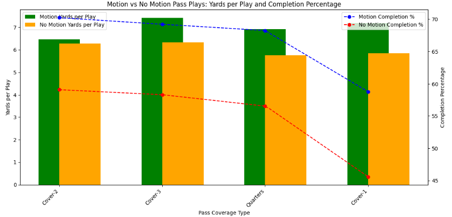

# Monitoring-Motion

## Project Overview
This is my contribution to the 2025 NFL Data Bowl Kaggle competition. The goal of the competition is to conduct prediction analysis using NFL pre-play and player tracking data from weeks 1-9 of the 2021 season. The findings are to then be presented as a PDF scouting report that could be read and interpreted by coach and player personnel.

In this project, I focused on predicting receiver routes on motion pass plays based on pre-snap motion variables. To achieve this, I performed EDA, implemented feature engineering, applied clustering techniques to identify motion types, and used advanced machine learning models for receiver route prediciton. All completed in Jupyter Notebook (python). 

I completed this project on my own in December of 2024. As someone who played football through high school and has been a lifelong Giants fan, I found this project quite interesting and enjoyable to complete. It's always fun to bring together my passion for data with anything else I have have interests in, in this case, football. 

## Project Process
This was a multi-step process that involved exploratory data analysis, data filtering, feature engineering, implementation of K-Means clustering, utilization of Random Forest Regressor, and finally the creation of a presentation for team personnel. 

### 1) Exploratory Data Analysis & Data Cleaning 
The exploratory data analysis portion of the project proved to be a crucial step, as it helped me to determine the goal of the project. In the EDA, there were substantial differences in how well NFL defenses performed against motion pass plays as opposed to non-motion pass plays, which sparked the idea to help defenses find a solution in limiting the effectiveness of these plays. 

The visual clearly shows the discrepancy in effectiveness of motion pass plays vs. non-motion pass plays. It shoud be noted the data was filtered to include only the 4 most utilized defenses against motion-pass plays, which is Cover-1, Cover-2, Cover-3, and Quarters. 

### 2) Data Filtering
The goal of the data filtering portion was to ensure the data being used throughout the rest of the analysis aligns with the goal of the project. This task also included ensuring storage efficiency - there was a lot of data that needed to be processed, so being inuitive with data loading and processing was essential in keeping RAM within limit. 

The data holds values for each player in a play, as well as each frame within a play, amounting to millions of datapoints within the dataset. For my analysis, I kept 2 main dataframes - a dataframe that holds all player data from motion pass plays, and a dataframe that holds only motion-receiver data from motion pass plays. Each held their own purpose for the analysis. 
